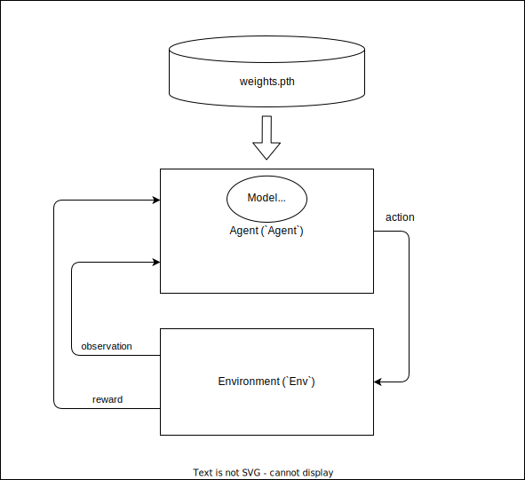

# Lunar Lander

#### Authors: Daniel Skora, Nihal Simha, Chase Ruskin

Final project for University of Michigan's CSE592: Foundations of AI. The goal of this project is to apply reinforcement learning (RL) methodologies to solving the lunar landing problem for generalized environments.

## Project Organization

The project is organized as follows:

- `/src`: Python scripts for RL experimentation (tracked)
- `/output`: Run-dependent artifacts that (untracked)
- `/data`: Plots and statistics regarding our experiments (tracked)
- `/weights`: Saved weight parameters from trained networks (tracked)

## System

### Environment

The environment is encapsulated in the `Env` class and uses a custom registered version of the lunar lander environment (`cse592/LunarLander`). This registered environment has more randomization for more generalization to the environment and lander, namely it allows for testing on randomized gravity values for the lunar surface and randomized initial `x` values for the lander.

As with the previous lunar lander environment, the lander also starts with a random initial velocity.


The two main functions of the `Env` are `reset(...)` and `step(...)`. The reset function will reset the enviroment to a new set of initial conditions. The step function takes in an action (presumably from an agent) and outputs the updates the environment according to the agent's action with the next observation, reward, and termination flag.

### Training

The training loop uses our `Trainer` class and the `train(...)` method to train the DQN model using a policy network and a target network. The training occurs for `n` episodes, and utilizes the Adam optimzer and a replay memory.


When training is finished, the program saves the weights it learned for the policy network to the `/weights` folder for future use.

### Inference

The inference loop uses our `Agent` class and the `run_episode(...)` method to run a single episode for the trained model. The agent encapsulates a model and loads the model's weights from a file that was previously written from a past training loop. 



Inference runs for `TRIALS` number of episodes, and the environment is reset for each episode. The lander's performance is recorded as the cumulative reward of the episode, along with the environment's set gravity for that instance. This data is saved to files and can be read again for plotting and further analysis.

## Getting Started

This project has been tested using Python >= 3.8.6. 

1. Install the Python-related dependencies:

```
pip install -r requirements.txt
```

2. Run our experiment:

```
python src/main.py
```

## Usage

### Human

To manually maneuver the lander using the keyboard:

```
python src/play.py [continuous | discrete]
```

### DQN

To train the DQN model:

```
python src/learn.py
```

To see the trained DQN model run inference:

```
python src/infer.py
```

### PPO

To train the PPO model:

```
python src/ppo_learn.py
```

To see the trained PPO model run inference:

```
python src/ppo_infer.py
```

## References

- https://gymnasium.farama.org
- https://pytorch.org/tutorials/intermediate/reinforcement_q_learning.html
- https://pytorch.org/tutorials/intermediate/reinforcement_ppo.html